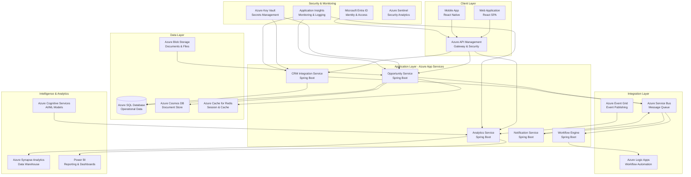
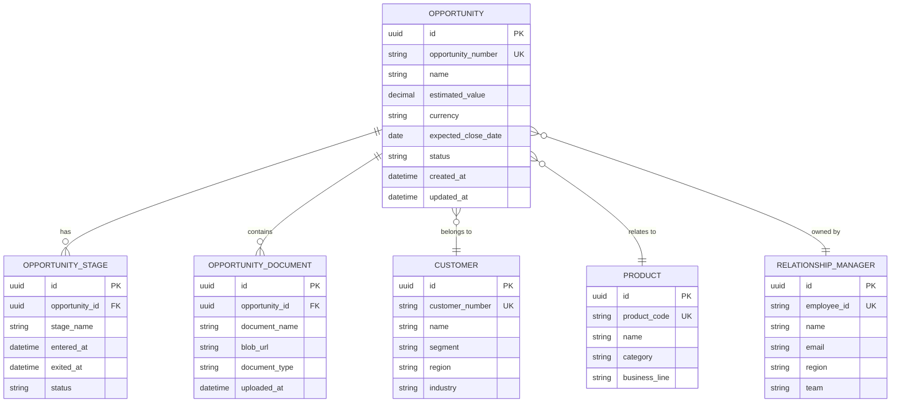
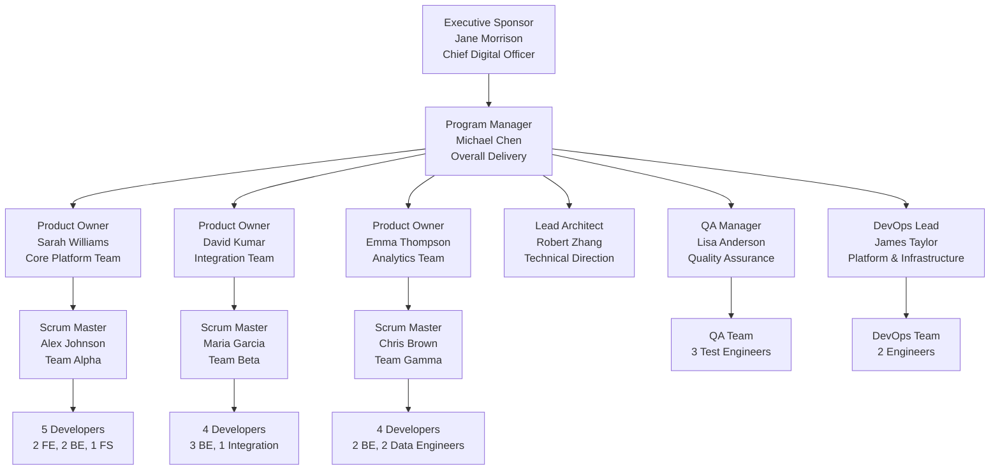
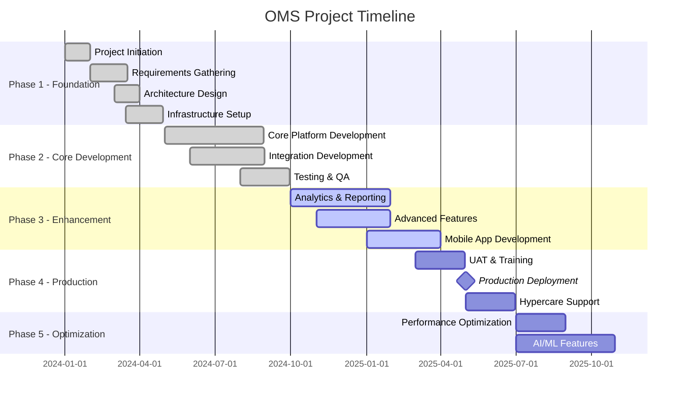
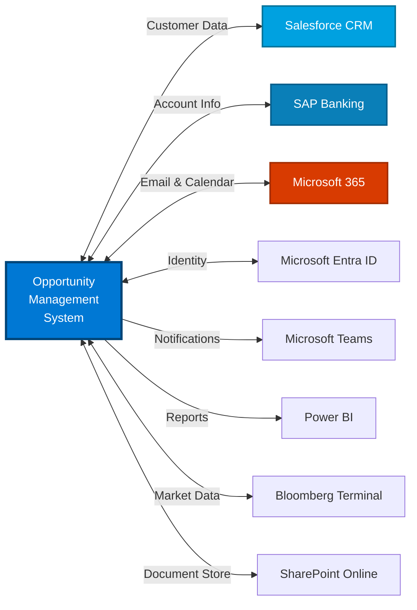

# Opportunity Management System (OMS)

## 📋 Executive Summary

The Opportunity Management System (OMS) is a comprehensive enterprise platform designed to streamline and optimize the opportunity lifecycle management for Global Financial Bank. This system enables relationship managers, sales teams, and business analysts to track, manage, and convert business opportunities into revenue-generating relationships.

**Project Status:** 🟢 In Development | **Version:** 2.1.0 | **Go-Live:** Q2 2026

---

## 🎯 Business Requirements

### 1. Functional Requirements

| ID | Requirement | Priority | Status |
|---|---|---|---|
| FR-001 | Opportunity creation and tracking | Critical | ✅ Complete |
| FR-002 | Customer relationship management integration | Critical | 🟡 In Progress |
| FR-003 | Automated workflow for opportunity stages | High | 🟡 In Progress |
| FR-004 | Real-time analytics and reporting dashboard | High | 🔴 Planned |
| FR-005 | Multi-currency support for global operations | High | ✅ Complete |
| FR-006 | Document management and versioning | Medium | 🟡 In Progress |
| FR-007 | Email and calendar integration | Medium | 🔴 Planned |
| FR-008 | Mobile application for field staff | Low | 🔴 Planned |
| FR-009 | AI-powered opportunity scoring | Low | 🔴 Backlog |
| FR-010 | Compliance and audit trail | Critical | ✅ Complete |

### 2. Non-Functional Requirements

#### Performance Requirements
- **Response Time:** < 2 seconds for 95% of transactions
- **Throughput:** Support 10,000 concurrent users
- **Availability:** 99.9% uptime (SLA)
- **Data Retention:** 7 years for compliance

#### Security Requirements
- OAuth 2.0 / OpenID Connect authentication
- Role-based access control (RBAC)
- Data encryption at rest and in transit
- GDPR and SOX compliance
- Multi-factor authentication (MFA)

#### Scalability Requirements
- Horizontal scaling capability
- Auto-scaling based on load
- Support for 500,000+ opportunities
- Global distribution across 3 regions

---

## 🏗️ System Architecture

### High-Level Architecture



### Technology Stack

| Layer | Technology | Version | Purpose |
|---|---|---|---|
| **Frontend** | React | 18.2.0 | Web UI framework |
| | TypeScript | 5.0 | Type-safe JavaScript |
| | Material-UI | 5.14 | Component library |
| **Backend** | Java | 17 LTS | Programming language |
| | Spring Boot | 3.1.x | Application framework |
| | Spring Cloud | 2023.0.x | Microservices framework |
| **Database** | Azure SQL Database | v12 | Relational database |
| | Azure Cosmos DB | - | NoSQL document store |
| | Azure Cache for Redis | 7.0 | Caching layer |
| **Cloud** | Microsoft Azure | - | Cloud platform |
| | Azure Kubernetes Service | 1.28 | Container orchestration |
| **DevOps** | Azure DevOps | - | CI/CD pipeline |
| | Terraform | 1.6 | Infrastructure as Code |
| | Docker | 24.0 | Containerization |

### Data Model Overview



---

## 👥 Team Structure & Organization

### Organizational Chart



### Scrum Teams

#### Team Alpha - Core Platform Team
**Focus:** Core opportunity management functionality, customer management

| Role | Name | Allocation |
|---|---|---|
| Product Owner | Sarah Williams | 100% |
| Scrum Master | Alex Johnson | 100% |
| Senior Frontend Developer | Tom Mitchell | 100% |
| Frontend Developer | Amy Lee | 100% |
| Senior Backend Developer | Raj Patel | 100% |
| Backend Developer | Sophie Martin | 100% |
| Full Stack Developer | Daniel Kim | 100% |

**Current Sprint:** Sprint 24 (Oct 21 - Nov 3, 2025)  
**Velocity:** 45 story points (average)  
**Key Deliverables:** Opportunity workflow automation, Advanced search functionality

#### Team Beta - Integration Team
**Focus:** External system integrations, API development

| Role | Name | Allocation |
|---|---|---|
| Product Owner | David Kumar | 100% |
| Scrum Master | Maria Garcia | 100% |
| Senior Backend Developer | Carlos Rodriguez | 100% |
| Backend Developer | Nina Schmidt | 100% |
| Backend Developer | Ahmed Hassan | 100% |
| Integration Specialist | Yuki Tanaka | 100% |

**Current Sprint:** Sprint 24 (Oct 21 - Nov 3, 2025)  
**Velocity:** 38 story points (average)  
**Key Deliverables:** Salesforce integration, SAP banking connector

#### Team Gamma - Analytics Team
**Focus:** Reporting, analytics, data warehouse, AI/ML features

| Role | Name | Allocation |
|---|---|---|
| Product Owner | Emma Thompson | 100% |
| Scrum Master | Chris Brown | 100% |
| Senior Backend Developer | Elena Popov | 100% |
| Backend Developer | Marcus Wright | 100% |
| Data Engineer | Priya Sharma | 100% |
| Data Engineer | Lucas Silva | 100% |

**Current Sprint:** Sprint 24 (Oct 21 - Nov 3, 2025)  
**Velocity:** 40 story points (average)  
**Key Deliverables:** Real-time dashboard, Predictive analytics POC

#### Supporting Teams

**QA Team**
- 3 Test Engineers
- Focus: Automated testing, regression testing, performance testing
- Tools: Selenium, JMeter, Postman

**DevOps Team**
- 2 DevOps Engineers
- Focus: CI/CD, infrastructure, monitoring
- Tools: Azure DevOps, Terraform, Kubernetes

---

## 📅 Project Timeline & Milestones



### Key Milestones

| Milestone | Date | Status | Description |
|---|---|---|---|
| 🎯 Project Kickoff | Jan 1, 2024 | ✅ Complete | Project initiated, team assembled |
| 🎯 Architecture Approval | Mar 30, 2024 | ✅ Complete | Technical architecture approved |
| 🎯 Infrastructure Ready | Apr 30, 2024 | ✅ Complete | Azure environment provisioned |
| 🎯 Core Platform MVP | Sep 1, 2024 | ✅ Complete | Basic opportunity management live |
| 🎯 Integration Hub Complete | Nov 30, 2024 | ✅ Complete | CRM integrations operational |
| 🎯 Analytics Dashboard | Jan 31, 2025 | 🟡 In Progress | Real-time reporting & analytics |
| 🎯 Mobile App Release | Mar 31, 2026 | 🔴 Planned | iOS and Android apps |
| 🎯 UAT Completion | Apr 30, 2026 | 🔴 Planned | User acceptance testing |
| 🎯 Production Go-Live | May 1, 2026 | 🔴 Planned | Full production deployment |
| 🎯 AI Features Launch | Oct 31, 2026 | 🔴 Planned | Predictive analytics & scoring |

---

## 🗺️ Feature Roadmap

### 2024 Roadmap (Completed)

#### Q1 2024 ✅
- [x] Project foundation and team setup
- [x] Azure infrastructure provisioning
- [x] CI/CD pipeline establishment
- [x] Core data model design

#### Q2 2024 ✅
- [x] Opportunity CRUD operations
- [x] User authentication and authorization
- [x] Basic workflow engine
- [x] Document management

#### Q3 2024 ✅
- [x] CRM integration (Salesforce)
- [x] Email notifications
- [x] Audit trail and compliance features
- [x] Multi-currency support

#### Q4 2024 ✅
- [x] SAP banking system integration
- [x] Advanced search and filtering
- [x] Bulk operations
- [x] Performance optimization phase 1

### 2025 Roadmap

#### Q1 2025 (Current - 75% Complete)
- [x] Real-time analytics dashboard
- [x] Power BI embedded reports
- [x] Data warehouse integration
- [ ] Calendar and meeting integration
- [ ] Enhanced workflow automation

#### Q2 2025 (Planned)
- [ ] Mobile application (iOS/Android)
- [ ] Offline capability
- [ ] Advanced reporting builder
- [ ] Customer 360-degree view
- [ ] Production deployment

#### Q3 2025 (Planned)
- [ ] AI-powered opportunity scoring
- [ ] Predictive analytics
- [ ] Natural language search
- [ ] Chatbot integration
- [ ] Performance optimization phase 2

#### Q4 2025 (Planned)
- [ ] Advanced AI recommendations
- [ ] Automated lead routing
- [ ] Market intelligence integration
- [ ] API marketplace
- [ ] Multi-tenancy support

---

## 💰 Budget & Financials

### Project Budget Summary

| Category | Budget (USD) | Spent to Date | Remaining | % Spent |
|---|---:|---:|---:|---:|
| **Personnel Costs** | $4,500,000 | $2,800,000 | $1,700,000 | 62% |
| Development Team | $3,200,000 | $2,000,000 | $1,200,000 | 63% |
| QA & Testing | $600,000 | $380,000 | $220,000 | 63% |
| DevOps & Infrastructure | $400,000 | $250,000 | $150,000 | 63% |
| Project Management | $300,000 | $170,000 | $130,000 | 57% |
| **Azure Cloud Costs** | $800,000 | $420,000 | $380,000 | 53% |
| Compute (App Services, AKS) | $320,000 | $170,000 | $150,000 | 53% |
| Database (SQL, Cosmos) | $240,000 | $130,000 | $110,000 | 54% |
| Storage & CDN | $80,000 | $40,000 | $40,000 | 50% |
| Networking & Security | $160,000 | $80,000 | $80,000 | 50% |
| **Software Licenses** | $450,000 | $280,000 | $170,000 | 62% |
| Development Tools | $150,000 | $95,000 | $55,000 | 63% |
| Third-party APIs | $180,000 | $110,000 | $70,000 | 61% |
| Monitoring & Security | $120,000 | $75,000 | $45,000 | 63% |
| **Training & Enablement** | $200,000 | $80,000 | $120,000 | 40% |
| **Contingency (15%)** | $750,000 | $150,000 | $600,000 | 20% |
| **TOTAL** | **$6,700,000** | **$3,730,000** | **$2,970,000** | **56%** |

### Monthly Azure Infrastructure Costs

```
Current Monthly Run Rate: $28,500
Projected Production Monthly Cost: $42,000
```

| Service | Current Monthly Cost | Production Estimate |
|---|---:|---:|
| Azure Kubernetes Service | $8,500 | $15,000 |
| Azure SQL Database | $6,000 | $9,000 |
| Azure Cosmos DB | $4,000 | $6,500 |
| Azure App Services | $3,000 | $4,000 |
| Azure Cache for Redis | $1,500 | $2,500 |
| Azure Storage & Blob | $1,000 | $1,500 |
| Azure Service Bus | $800 | $1,200 |
| Application Insights | $1,200 | $1,800 |
| Azure API Management | $1,500 | $1,500 |
| Other Services | $1,000 | $1,000 |

### ROI Projections

**Expected Business Value:**
- **Efficiency Gains:** 40% reduction in opportunity processing time
- **Revenue Impact:** $15M additional revenue from improved conversion (Year 1)
- **Cost Savings:** $2M annual savings from process automation
- **Break-even:** Expected in 18 months post-production

---

## 🔗 Dependencies & Integrations

### External System Dependencies



### Integration Details

| System | Type | Protocol | Frequency | Owner | Status |
|---|---|---|---|---|---|
| Salesforce CRM | Bidirectional | REST API | Real-time | Sales Operations | ✅ Live |
| SAP Banking | Bidirectional | OData/RFC | Batch (Daily) | IT Core Banking | ✅ Live |
| Microsoft 365 | Bidirectional | Microsoft Graph | Real-time | IT Infrastructure | 🟡 In Progress |
| Microsoft Entra ID | Authentication | OIDC/OAuth 2.0 | Real-time | IT Security | ✅ Live |
| Bloomberg Terminal | Read-only | Bloomberg API | Hourly | Market Data Team | 🔴 Planned |
| SharePoint Online | Bidirectional | Microsoft Graph | Real-time | IT Infrastructure | 🟡 In Progress |
| Microsoft Teams | Outbound | Bot Framework | Event-driven | IT Infrastructure | 🔴 Planned |
| Power BI | Outbound | Power BI REST API | On-demand | BI Team | ✅ Live |

### Critical Dependencies

1. **Salesforce CRM Upgrade**
   - Required for advanced API features
   - Scheduled: Q1 2026
   - Impact: High priority integration features on hold

2. **SAP Banking Modernization**
   - Migration from RFC to REST APIs
   - Scheduled: Q3 2026
   - Impact: Performance improvements delayed

3. **Network Firewall Rules**
   - Approval pending for Bloomberg connection
   - Timeline: 6-8 weeks
   - Impact: Market intelligence features delayed

---

## 📊 Key Performance Indicators (KPIs)

### Business KPIs

| KPI | Target | Current | Trend |
|---|---|---|---|
| Opportunity Conversion Rate | 35% | 28% | 📈 +5% |
| Average Deal Cycle Time | 45 days | 52 days | 📈 -3 days |
| User Adoption Rate | 90% | 75% | 📈 +10% |
| Customer Satisfaction Score | 4.5/5 | 4.2/5 | 📊 Stable |
| System Availability | 99.9% | 99.7% | 📈 +0.2% |
| Data Accuracy | 98% | 96% | 📈 +1% |

### Technical KPIs

| KPI | Target | Current | Status |
|---|---|---|---|
| API Response Time (p95) | < 500ms | 420ms | ✅ |
| Database Query Time (p95) | < 200ms | 180ms | ✅ |
| Page Load Time | < 2s | 1.8s | ✅ |
| Error Rate | < 0.1% | 0.08% | ✅ |
| Code Coverage | > 80% | 78% | 🟡 |
| Deployment Frequency | Daily | Daily | ✅ |
| Mean Time to Recovery (MTTR) | < 1 hour | 45 min | ✅ |

---

## 🔐 Security & Compliance

### Security Controls

| Control | Implementation | Status |
|---|---|---|
| Authentication | Microsoft Entra ID with MFA | ✅ Implemented |
| Authorization | Role-Based Access Control (RBAC) | ✅ Implemented |
| Data Encryption (Transit) | TLS 1.3 | ✅ Implemented |
| Data Encryption (Rest) | Azure Storage Encryption | ✅ Implemented |
| Secret Management | Azure Key Vault | ✅ Implemented |
| Network Security | NSG, Private Endpoints, WAF | ✅ Implemented |
| API Security | OAuth 2.0, Rate Limiting | ✅ Implemented |
| Vulnerability Scanning | Azure Defender, SonarQube | ✅ Implemented |
| Penetration Testing | Annual third-party audit | 🔴 Scheduled Q1 2026 |

### Compliance Requirements

- ✅ **GDPR** - General Data Protection Regulation
- ✅ **SOX** - Sarbanes-Oxley Act
- ✅ **PCI DSS** - Payment Card Industry Data Security Standard
- ✅ **ISO 27001** - Information Security Management
- 🟡 **SOC 2 Type II** - In progress (audit Q2 2026)

---

## 🚀 Deployment Strategy

### Environments

| Environment | Purpose | URL | Azure Region |
|---|---|---|---|
| **Development** | Active development | dev-oms.globalbank.internal | East US 2 |
| **Testing** | QA and integration testing | test-oms.globalbank.internal | East US 2 |
| **Staging** | Pre-production validation | staging-oms.globalbank.internal | East US 2 |
| **Production** | Live system | oms.globalbank.com | East US 2 (Primary)<br/>West Europe (DR) |

### Deployment Pipeline

```mermaid
graph LR
    DEV[Developer<br/>Commit] --> BUILD[Build &<br/>Unit Tests]
    BUILD --> SCAN[Security<br/>Scan]
    SCAN --> DEV_ENV[Deploy to<br/>Dev]
    DEV_ENV --> INT_TEST[Integration<br/>Tests]
    INT_TEST --> TEST_ENV[Deploy to<br/>Test]
    TEST_ENV --> QA[QA<br/>Validation]
    QA --> STAGE_ENV[Deploy to<br/>Staging]
    STAGE_ENV --> UAT[User<br/>Acceptance]
    UAT --> APPROVAL[Production<br/>Approval]
    APPROVAL --> PROD[Deploy to<br/>Production]
    PROD --> SMOKE[Smoke<br/>Tests]
    
    style APPROVAL fill:#ff9900,stroke:#cc7700,stroke-width:2px
    style PROD fill:#00aa00,stroke:#007700,stroke-width:2px,color:#fff
```



### Release Schedule

- **Development Deployments:** Continuous (multiple times per day)
- **Testing Deployments:** Daily (8 AM EST)
- **Staging Deployments:** Weekly (Tuesdays, 10 AM EST)
- **Production Deployments:** Bi-weekly (Every other Thursday, 8 PM EST)

---

## 📚 Documentation & Resources

### Technical Documentation

- [API Documentation](./docs/api/README.md) - OpenAPI/Swagger specifications
- [Architecture Decision Records](./docs/adr/README.md) - Key architectural decisions
- [Database Schema](./docs/database/schema.md) - ER diagrams and table definitions
- [Deployment Guide](./docs/deployment/README.md) - Infrastructure and deployment procedures
- [Developer Guide](./docs/developer/README.md) - Setup and contribution guidelines
- [Security Guidelines](./docs/security/README.md) - Security best practices

### User Documentation

- [User Manual](./docs/user-guide/README.md) - End-user documentation
- [Admin Guide](./docs/admin-guide/README.md) - System administration
- [Training Materials](./docs/training/README.md) - Training videos and guides
- [FAQ](./docs/faq/README.md) - Frequently asked questions

### Project Resources

- **Jira Board:** https://globalbank.atlassian.net/projects/OMS
- **Confluence Space:** https://globalbank.atlassian.net/wiki/spaces/OMS
- **Git Repository:** https://dev.azure.com/globalbank/OMS
- **Slack Channel:** #oms-project
- **Teams Channel:** Opportunity Management System

---

## 📞 Contacts & Support

### Project Leadership

| Role | Name | Email | Phone |
|---|---|---|---|
| Executive Sponsor | Jane Morrison | jane.morrison@globalbank.com | +1 (212) 555-0101 |
| Program Manager | Michael Chen | michael.chen@globalbank.com | +1 (212) 555-0102 |
| Lead Architect | Robert Zhang | robert.zhang@globalbank.com | +1 (212) 555-0103 |

### Scrum Team Contacts

| Team | Scrum Master | Email | Slack |
|---|---|---|---|
| Team Alpha | Alex Johnson | alex.johnson@globalbank.com | @alex.johnson |
| Team Beta | Maria Garcia | maria.garcia@globalbank.com | @maria.garcia |
| Team Gamma | Chris Brown | chris.brown@globalbank.com | @chris.brown |

### Support

- **Development Support:** oms-dev@globalbank.com
- **Production Issues:** oms-support@globalbank.com (24/7)
- **Security Incidents:** security@globalbank.com
- **On-call Rotation:** https://pagerduty.globalbank.com/oms

---

## 🔄 Change Log

### Version 2.1.0 (October 2025) - Current

- ✨ Added real-time analytics dashboard
- ✨ Implemented Power BI embedded reports
- 🐛 Fixed opportunity status calculation bug
- ⚡ Performance improvements for search functionality
- 📝 Updated API documentation

### Version 2.0.0 (August 2025)

- ✨ Major UI/UX redesign
- ✨ Advanced workflow engine
- ✨ Multi-currency support
- 🔐 Enhanced security with MFA
- 📊 New reporting capabilities

### Version 1.5.0 (May 2025)

- ✨ SAP banking integration
- ✨ Document version control
- 🐛 Critical bug fixes in workflow engine
- ⚡ Database query optimization

### Version 1.0.0 (September 2024)

- 🎉 Initial production release
- ✨ Core opportunity management
- ✨ Salesforce integration
- ✨ Basic reporting

---

## 📋 Appendix

### Glossary

| Term | Definition |
|---|---|
| **Opportunity** | A potential business deal or sales prospect that could generate revenue |
| **Pipeline** | Collection of opportunities in various stages of the sales cycle |
| **Conversion Rate** | Percentage of opportunities that result in closed deals |
| **Deal Cycle Time** | Average time from opportunity creation to closure |
| **Relationship Manager** | Bank employee responsible for managing customer relationships |
| **AKS** | Azure Kubernetes Service - managed container orchestration |
| **Azure SQL** | Managed relational database service in Azure |
| **Cosmos DB** | Globally distributed NoSQL database service |

### Acronyms

- **OMS** - Opportunity Management System
- **CRM** - Customer Relationship Management
- **RBAC** - Role-Based Access Control
- **MFA** - Multi-Factor Authentication
- **API** - Application Programming Interface
- **CI/CD** - Continuous Integration/Continuous Deployment
- **UAT** - User Acceptance Testing
- **DR** - Disaster Recovery
- **SLA** - Service Level Agreement
- **KPI** - Key Performance Indicator

### References

1. [Azure Well-Architected Framework](https://learn.microsoft.com/en-us/azure/well-architected/)
2. [Spring Boot Best Practices](https://spring.io/guides)
3. [Java Secure Coding Guidelines](https://www.oracle.com/java/technologies/javase/seccodeguide.html)
4. [GDPR Compliance Guide](https://gdpr.eu/)
5. [API Design Guidelines](https://learn.microsoft.com/en-us/azure/architecture/best-practices/api-design)

---

**Last Updated:** October 31, 2025  
**Document Owner:** Michael Chen (Program Manager)  
**Classification:** Internal Use Only  
**Version:** 2.1.0
